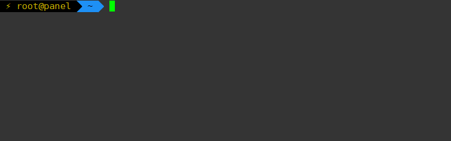
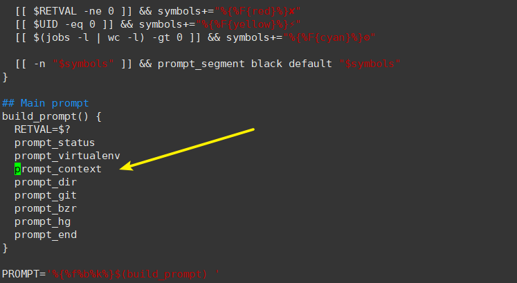
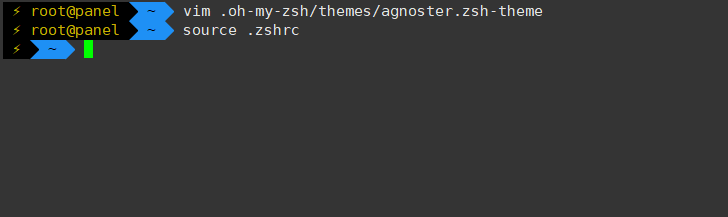
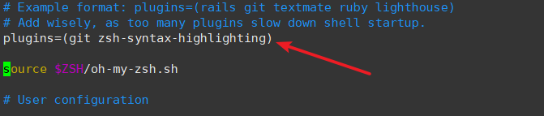
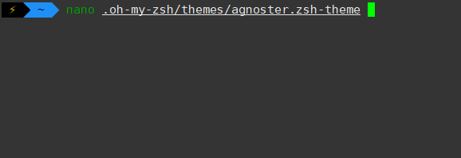

虽说CLI是一个强调效率的主阵地，但是快不快是几个工具的事情，好不好看可就是一辈子的事情了。毕竟没有颜色的CLI没有灵魂。每天面对着黑白相间的CLI多少有些无聊，就算xshell这样的工具提供了许多自定义的选项，但是仍无法解决颜狗的需求。

早就听过大名鼎鼎的[OhMyZsh](https://github.com/robbyrussell/oh-my-zsh)项目，今天就来上手看一看。

## 安装

首先确认一下前置环境```bashaptinstallgit-corezshfonts-powerline```那个字体包是给zsh的部分主题使用的，剩下的安装体验非常愉快，只需一行命令，这个大部分成熟的开源项目都一样。毕竟，降低了门槛，入门的人自然就变多了。

```zsh
sh -c "$(curl-fsSL https://raw.githubusercontent.com/robbyrussell/oh-my-zsh/master/tools/install.sh)"
```

## 配置

安装完成之后你的shell就已经被替换为zsh了，当然，这还不够美观，我们去更改一下主题文件
```zsh
vim~/.zshrc
```
找到`ZSH_THEME="robbyrussell"`将后面的值改为你想要的主题，大部分的主题预览都在[这里](https://github.com/robbyrussell/oh-my-zsh/wiki/themes)我个人喜欢agnoster，这里就改为`ZSH_THEME="agnoster"`，保存并退出。然后

```zsh
source ~/.zshrc
```
使得更改立即生效，这个时候你的CLI看起来大概是这个样子的看起来我们并不需要主机名称，此时可以更改主题文件
```zsh
vim~/.oh-my-zsh/themes/agnoster.zsh-theme
```
注释掉这一行就好，然后重新输入
```zsh
source ~/.zshrc
```
最终的效果就是这样了当然，每个主题里还有很多可调参数，自定义程度很高。

## 插件

如果只是简单的主题修改怎么能满足颜狗的需求，当然还要有命令高亮，快速联想。zsh的扩展性非常好，我们可以简单的通过git和配置文件来添加插件或去除插件，具体的插件列表在[这里](https://github.com/robbyrussell/oh-my-zsh/wiki/Plugins)这里以语法高亮插件为例
```zsh
cd ~/oh-my-zsh/custom/plugins/
git clone https://github.com/zsh-users/zsh-syntax-highlighting.git
```
之后去`.zshrc`中启用这个插件
```zsh
vim~/.zshrc
```
接下来
```zsh
source ~/.zshrc
```

立即生效

## 更新

OhMyZsh自带更新功能，这个更新是基于GithubAPI和git工具的，但是如果我们更改了主题文件（就像本文这样）在更新的时候会因为修改的文件无法更新，我们有两种办法。1.把自定义的主题文件另存为一个新的名字，然后在`.zshrc`中重新引用2.在更新的时候使用`gitstash`忽略掉被更改的文件
```zsh
cd ~/.oh-my-zsh
git status
git stash upgrade_oh_my_zsh
git stash pop
```
这样就算完成了更新

## OhMyBash

作为OhMyZsh的姊妹项目，[OhMyBash](https://github.com/ohmybash/oh-my-bash)的完成度也非常不错，如果你有诸多原因不能迁移到Zsh，那么不妨选择他来美化你的CLI吧。[scodetype="yellow"]美化虽好，可不要忘记效率[/scode]
