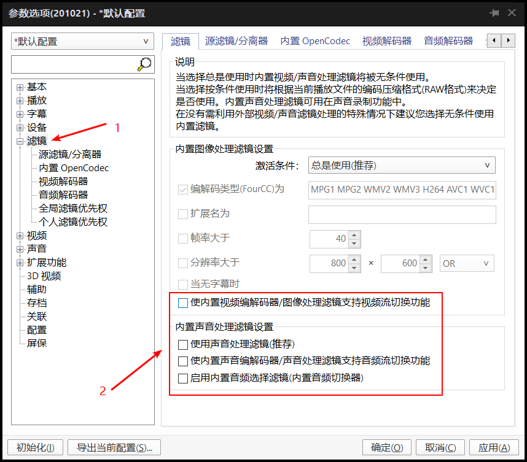
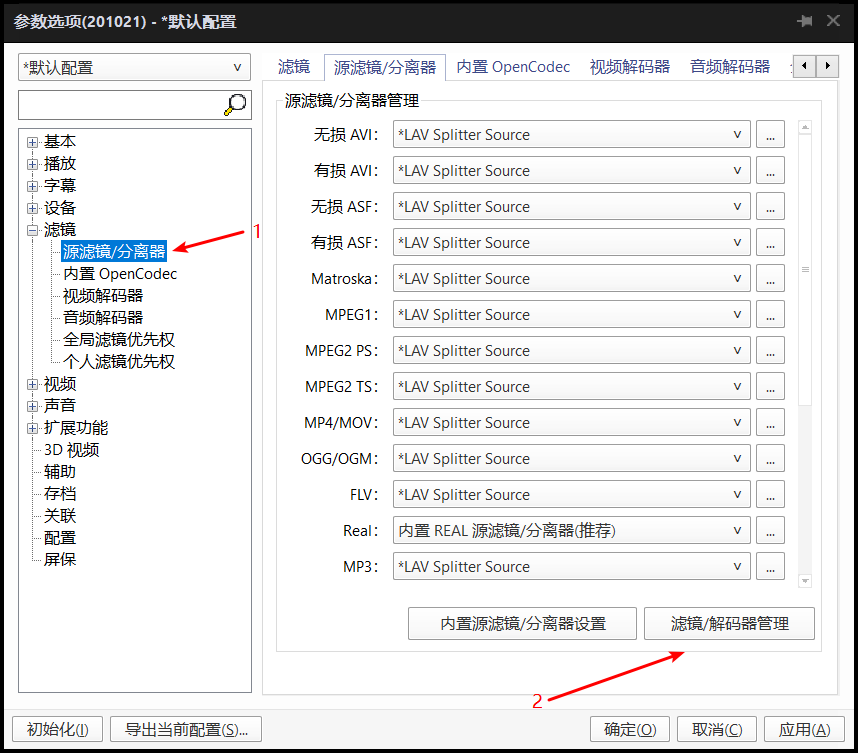
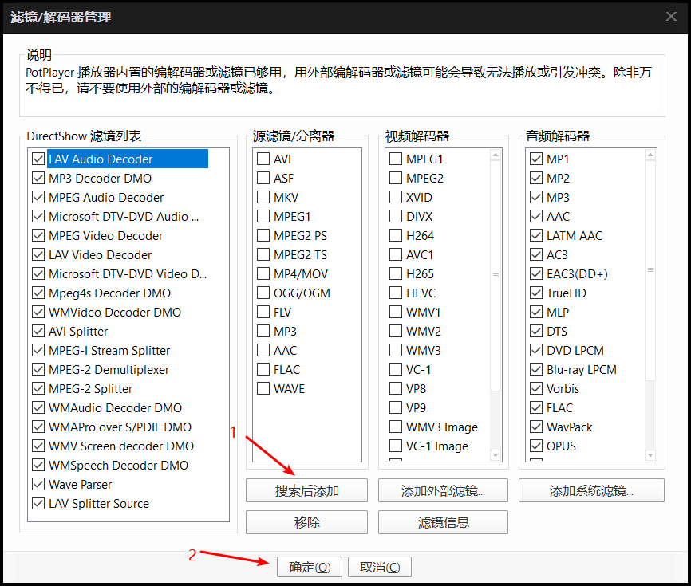
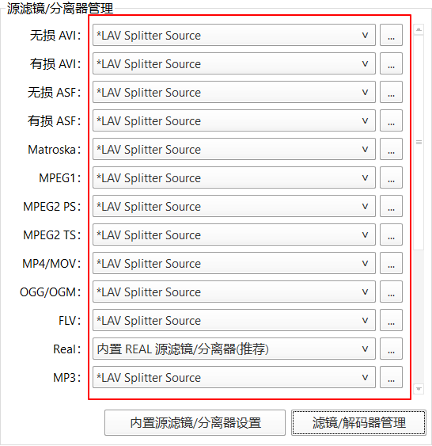
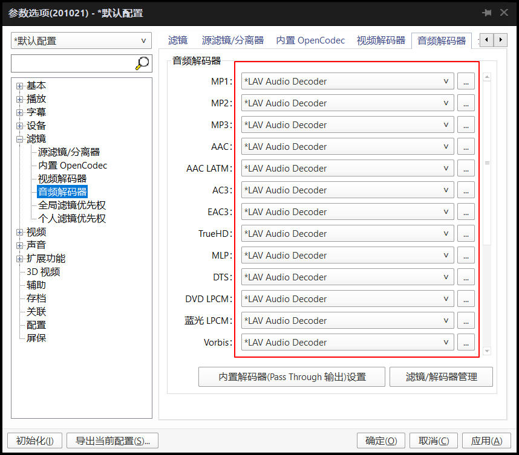
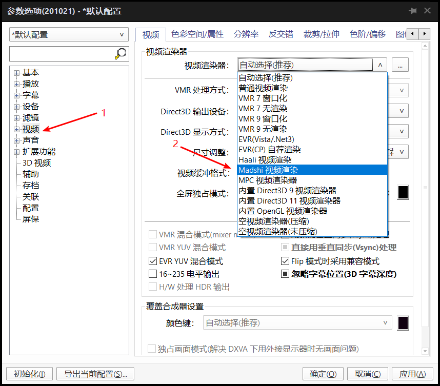
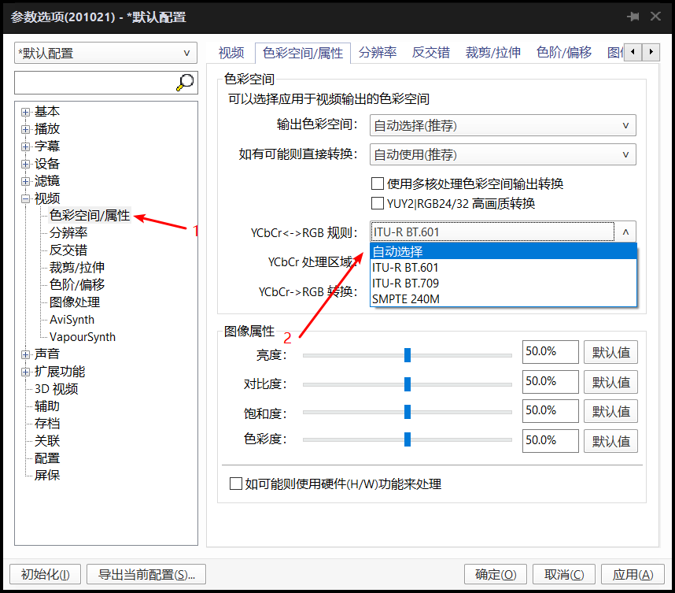
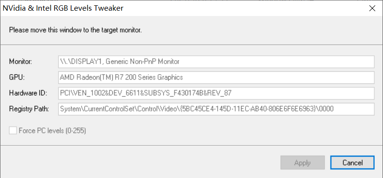
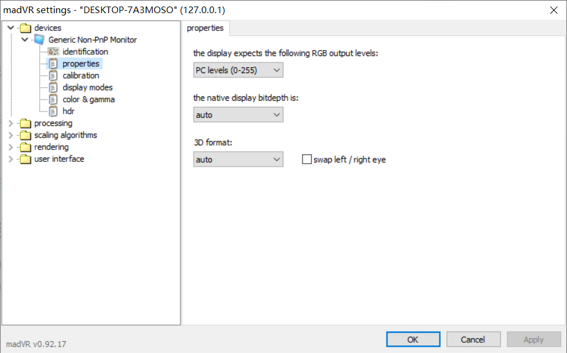
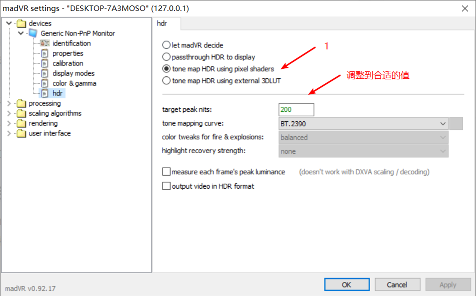

import Callout from '@/components/Callout.astro'

对于当下的手机和平板等移动设备的屏幕来说，支持HDR的解码和展示已经是基本要求。想要在仅支持SDR的屏幕上获得合格的HDR体验，需要将HDR视频中的亮度信息正确的映射到SDR范围内（下变换）。这篇文章就将简单介绍在PC上如何使用Potplayer配合Madvr将HDR视频下变换到SDR区间，并获得正确的画面。

## 0x00

开始之前本篇教程参考了中文互联网中能够查找到的两篇关键攻略：1.vcb-studio的科普教程2.5（由于vcbstudio的博客下线导致我无法给出致谢链接）2.[万年冷冻库的madvr系列教程](https://lysandria1985.blogspot.com)他的博客中不仅仅包含了对madvr每一个设置选项的详细介绍，也对一系列能提高画质体验的软件做了推荐，推荐给对画质有着更高要求的玩家。本篇教程应花村的邀请进行撰写，首要目标是解决HDR视频在PC上的正确映射。本文中包含了Potplayer（播放器）、LAVFilters（音视频分离器/解码器）、madVR（视频渲染器）等工具，文章中会给出对应的链接。以上工具请安装在非中文路径下，避免因为CJK问题导致无法使用。安装顺序：Potplayer、LAVFilter、madVR

## 0x01显卡设置

### Intel

打开Intel核芯显卡控制面板，在一般设置中将量化范围改为全范围

### Nvidia

打开NVIDIA控制面板，在视频-调整视频颜色设置中，选择“通过NVIDIA设置”，并将动态范围设置为“完全（0-255）”

### AMD

在显示器设置选项卡中，将像素格式改为“RGB 4:4:4 Pixel Format PC Standard (FullRGB)”

## 0x02 Potplayer选项设置
### 滤镜部分
在[potplayer官网](https://daumpotplayer.com/download)下载安装potplayer后，在播放界面右键-选项，打开设置页面（或者直接使用快捷键F5）在滤镜菜单中，取消勾选以下四项-使内置视频编解码器/图像处理滤镜支持视频流切换功能-使用声音处理滤镜-使内置音频编解码器/声音处理滤镜支持音频流切换功能-启用内置音频选择滤镜（内置音频切换器）关闭potplayer内置的滤镜是为了能让LAVFilter接管更高精度的图像，接下来[下载LAVFilter](https://github.com/Nevcairiel/LAVFilters/releases)，选择Installer版本，进行安装，默认安装设置即可。在滤镜下的“源滤镜/分离器”中，点击“滤镜/解码器管理”，在新弹出的滤镜管理窗口中点击“搜索后添加”，然后确认，随后在滤镜/分离器管理中，将所有的选项都转为LAVSplitterSource，无法转换的保持默认即可。（小技巧，鼠标滚轮可以快速切换选项）随后在视频解码器和音频解码器选项卡中使用相同的方法，将所有的解码器换成我们刚刚安装的LAVDecoder。

### 视频部分

接下来将要替换potplayer的默认渲染器，首先去[madVR](https://madvr.com)下载，将下载的文件解压出来后，以管理员身份运行`install.bat`即可完成安装。随后在potplayer的视频设置中，将视频渲染方式改为Madshi视频渲染，在视频下的色隙/属性中，将YCbCr->RGB规则改为自动选择。

## 0x03 madVR设置

### 初始化显示器参数

安装完成madVR后，请在解压出的文件中运行`madLevelsTweaker.exe`，将显示信息色彩范围调节到0-255

### 更改HDR映射设置

然后运行`madHcCtrl.exe`这样，就可以在托盘找到madVR，右键这个图标，选择`Edit madVR Settings`。在Device选项卡下，可以看到你的显示器名称，在`properties`中将显示输出范围调整到`PClevels(0-255)`，然后在hdr选项卡中，将hdr输出设定改为`tone map HDR using pixel shaders`同时调整峰值亮度为你显示器的合适亮度，当然如果你对显示器的亮度参数并不了解，这里可以选择让`let madVR decide`。对于想要折腾的玩家，可以使用3DLUT，获得更为自定义的映射曲线至此，你的Potplayer就可以正确的将HDR视频映射到SDR的显示器上了。

## 0x04后续

本文只对使用madVR对HDR进行下变换做了简单介绍，事实上，madVR还可以实现对字幕的更高精度渲染，这部分需要借助xy-SubFilter滤镜，这部分我会另开新坑。
